### 作者QQ：1556708905(支持修改、 部署调试、 支持代做毕设)

#### 支持代做任何毕设论、接网站建设、小程序、H5、APP、各种系统等

**毕业设计所有选题地址 [https://github.com/zhengjianzhong0107/allProject](https://github.com/zhengjianzhong0107/allProject)**

**博客地址：[https://blog.csdn.net/2303_76227485/article/details/128650982](https://blog.csdn.net/2303_76227485/article/details/128650982)**

**视频演示：[https://space.bilibili.com/384537280](https://space.bilibili.com/384537280)**

## 基于Springboot的网上商城管理系统(源代码+数据库+19000字论文)

## 一、系统介绍

需求设计主要参考天猫商城的购物流程：

用户从注册开始，到完成登录，浏览商品，加入购物车，进行下单，确认收货，评价等一系列操作。

作为迷你天猫商城的核心组成部分之一，管理后台包含商品管理，订单管理，类别管理，

用户管理和交易额统计等模块，实现了对整个商城的一站式管理和维护。

## 二、所用技术

后端技术栈：

- Spring Boot+MySQL+Druid+Log4j2+Maven+mybatis

前端技术栈：

- Echarts+Bootstrap

## 三、环境介绍

基础环境 :IDEA/eclipse, JDK 1.8, Mysql5.7及以上,Maven

源码+数据库脚本

所有项目以及源代码本人均调试运行无问题 可支持远程调试运行

所有页面均兼容IE10及以上现代浏览器。

## 四、项目界面

+ ##### 前台界面(部分)---

  

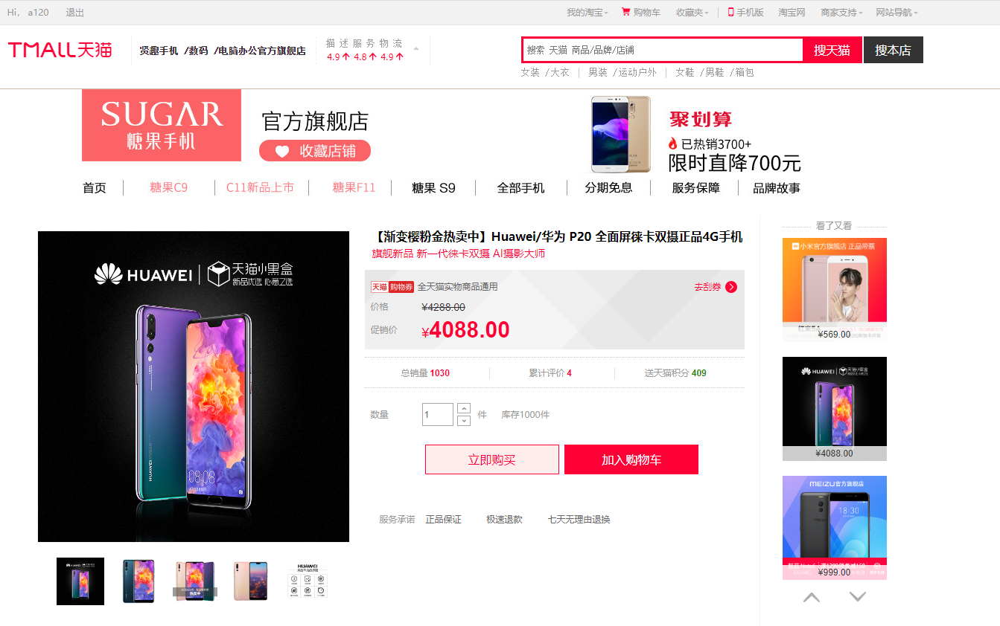

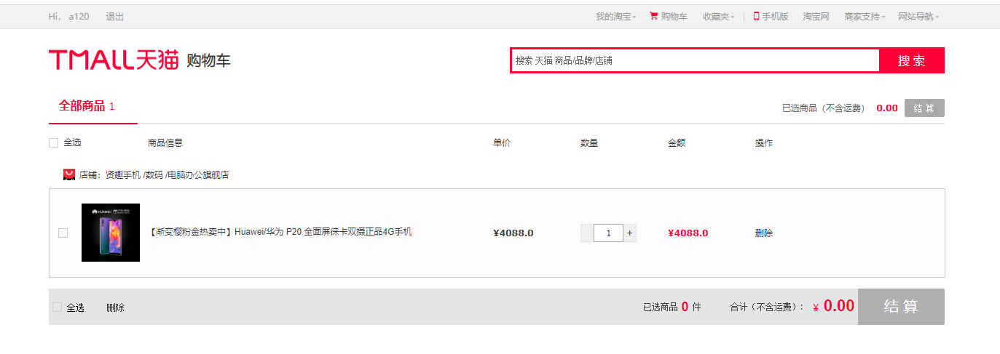

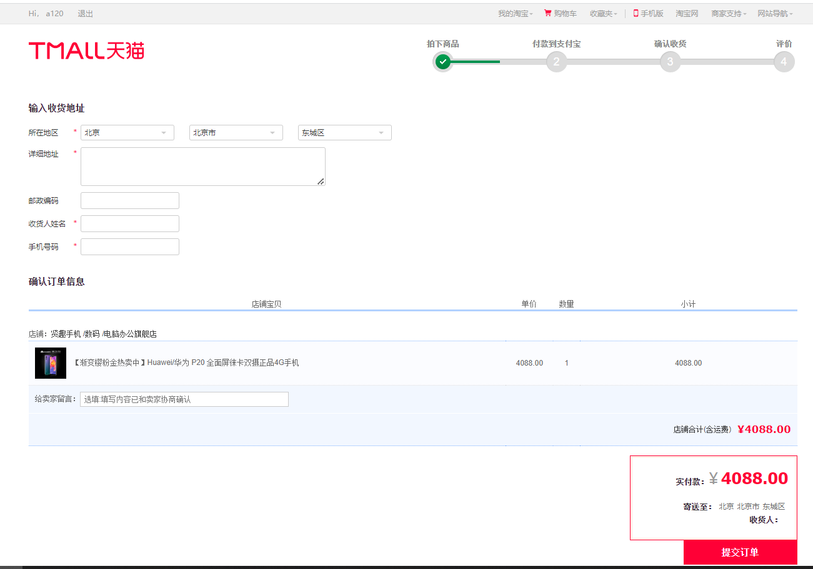

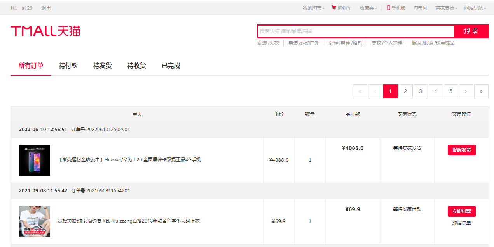

+ ##### 后台界面(部分)---

  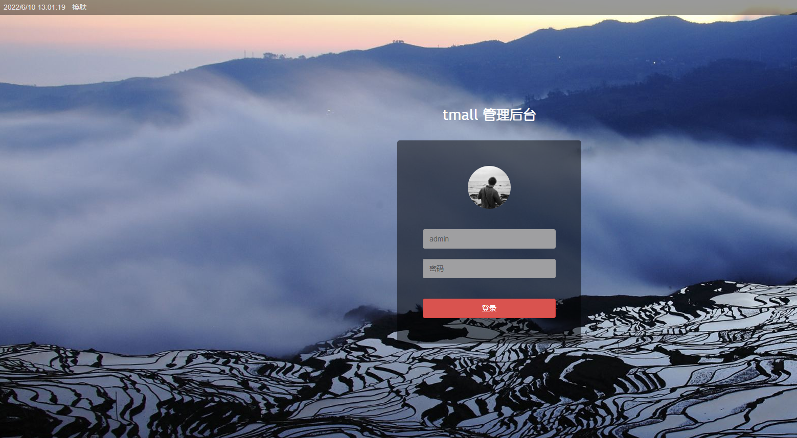

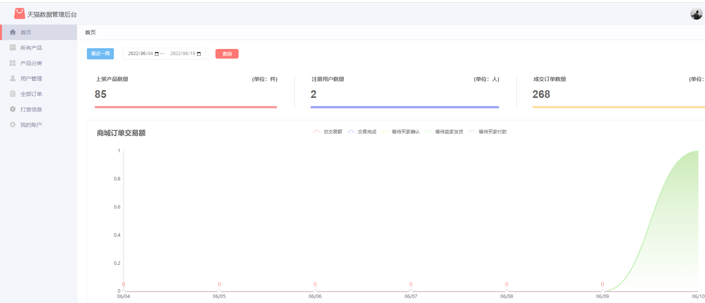

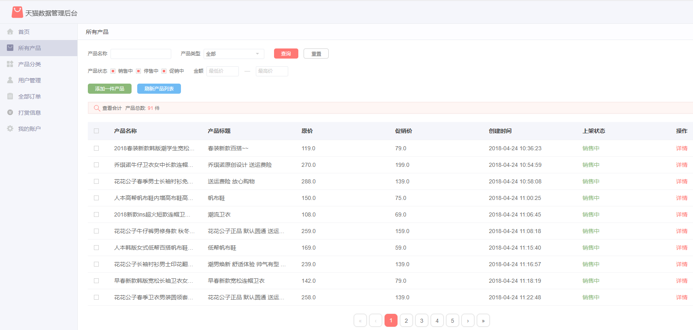

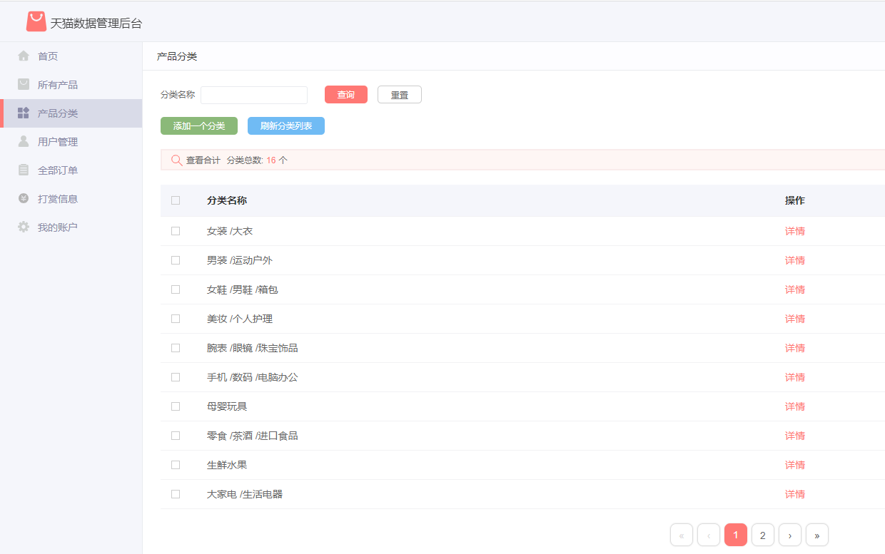

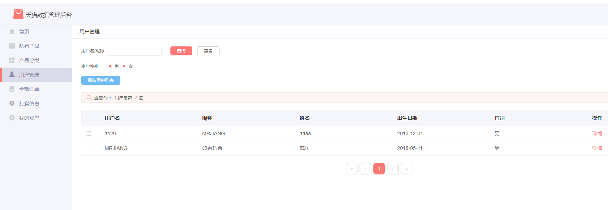

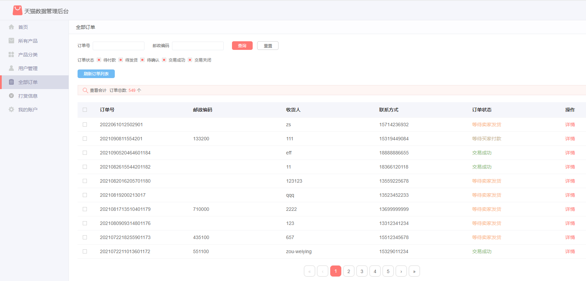

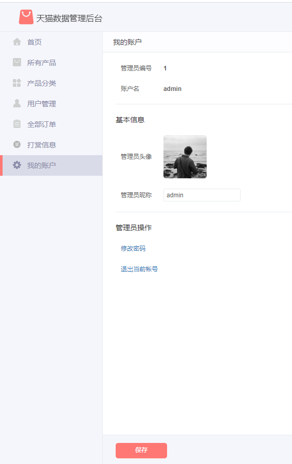

### 五、运行地址

+ 前台地址：<http://localhost:8099/tmall>  用户名：a120   密码： 123456
+ 后台地址：<http://localhost:8099/tmall/admin>  用户名：admin   密码： 123456

### 六、部署方式

1. 项目数据库为MySQL 5.7版本，在**sqls文件夹**中找到SQL文件并导入到数据库中。
2. 使用IDEA打开项目后，在maven面板刷新项目，下载依赖包。
3. 配置数据库连接并启动SpringBootApplication即可。

### 注意事项：

1. 后台管理界面的订单图表没有数据为正常现象，该图表显示的为近7天的交易额。
2. 该项目同时兼容eclipse，但如有自行扩展代码的意愿，建议使用IDEA。

### 关于拓展

近期本项目通过改造，将原来war部署方式改成了jar部署，进入到target目录，仅需要java -jar tmall.jar即可完成部署启动。

另本项目已使用当前较为流利的CICD方式，jenkins+k8s进行持续构建、部署，涉及文件:Dockerfile,K8sJenkinsFile及deploy.yaml

Dockerfile:大概作用是依据基础的jdk镜像，添加上自己本身的jar包，打成镜像包

K8sJenkinsFile:大概作用是把生成jar包、部署jar包流程自动化

deploy.yaml:此文件为k8s deployment svc资源模板化文件

k8s部署的项目访问网址: 

